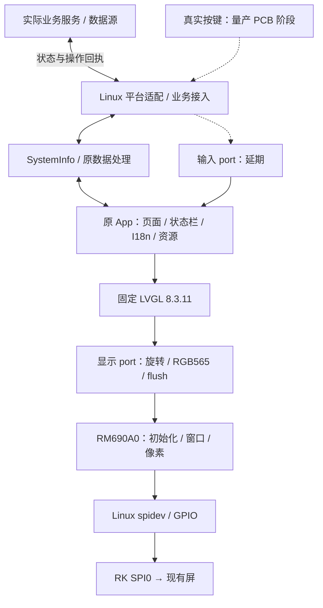

# RK3506J RM690A0 / LVGL 应用迁移架构与计划

更新日期：2026-09-24。当前完成资料分析、架构规划、Docker 环境、P2 离线构建基线及 P3 屏驱动实现；P3 已用 SPI mode 3 在实屏显示测试图，外壳遮挡部分边缘，物理波形和最高速率未测。原业务应用尚未迁移。

## 1. 目标与范围

移除 HC32，由 RK3506J 在 Linux 上直接驱动现有 RM690A0 屏幕，迁移原应用的页面、资源、交互与业务状态。保持 294×126 横向 UI、RGB565、页面动画与英俄语言切换，并接入真实业务数据、输入和关机流程。

首版按“显示点亮 → 原应用显示迁移 → 业务接入 → SDK 集成”推进。用户确认当前测试板为 RK3506J 512MB+8GB，屏沿用现有供电电路，正常启动并经 SPI 传输后自动点亮；当前不做背光亮度控制。按键及整机电源相关功能明确延后到量产 PCB 阶段，当前无需实现，也不作为显示构建前置条件。显示测试、真实业务与量产功能分别验收；演示数据不能作为完整业务迁移交付。新增远程管理、多屏、固件升级不在本轮范围。

详细来源、初始化序列和迁移注意事项见 [HC32 迁移摘要](HC32_MIGRATION.md)。P2 已完成原厂 kernel/rootfs 构建、Simulator 对照构建与主机/ARM LVGL 基线验证；HC32 原工程保持不变，Simulator 修复只应用到隔离副本。未烧录硬件。构建结果与复现见 [P2 基线](P2_BASELINE.md)。

P1 的实接线、设备树冲突检查和阶段边界见 [硬件定型记录](../board/rk3506j/HARDWARE.md)。当前测试板显示接口已定型，P2 离线构建已完成，P3 测试图已实屏显示；存储介质、电气参数和物理波形仍需后续核实，不代表量产硬件验收已完成。

## 2. 技术基线

| 项目 | 当前依据 | 规划决定 |
| --- | --- | --- |
| 构建主机 | SDK 手册 V1.5 §1.2–1.4：Ubuntu 20.04、普通用户、至少 100 GB 空间、建议至少 8 GB 内存 | 使用已构建 Docker 环境 |
| RK SDK | sdk/atk_dlrk3506_linux6.1_release_v1.3.1_20260326；Linux 6.1、Buildroot、ARM32/Cortex-A7 | 测试板 512MB+8GB，P2 暂按 J/eMMC 的 22 号配置准备；板端确认介质/容量后用于部署 |
| 交叉工具链 | kernel 预置 GCC 10.3.1；Buildroot 配置为 GCC 12.4.0/glibc | 应用使用 Buildroot 生成的工具链、加载器与 sysroot |
| 应用来源 | HC32 的 Simulator/App，固件也编译此目录 | 保留原 C11/C++17 应用结构与资源 |
| LVGL | 旧工程 8.3.11；RK SDK 提供 8.4.0/9.1 配方 | 首版固定旧 8.3.11 验证迁移，不混用 SDK 另一份库 |
| 屏驱动 | Adafruit_ST7789 类内实际使用 generic_RM690A0 | 提取实际命令协议，替换 Arduino/HC32 传输依赖 |
| 显示参数 | 126×294 控制器坐标 + LVGL ROT_90 → 294×126 UI；RGB565 | 保留方向、字节序、窗口寻址，取消单色页打包假设 |
| SPI | RK J 型 dtsi 包含已启用 SPI0/spidev 的板级 dtsi | 复用内核控制器驱动；运行时确认节点与引脚占用 |

LVGL 8.4.0 升级可以后续独立验证，不与硬件迁移同时强制进行。应用私有链接旧 LVGL 时，构建规则必须明确依赖归属，避免 SDK 默认 DRM 示例或另一版本 LVGL 混入目标。

## 3. 硬件映射与边界

RK 接口依据本项目原理图 ATK-DLRK3506JS V1.0.pdf 第 4 页与 SDK rk3506-pinctrl.dtsi；旧接线依据 HC32 mcu_config.h。SCLK、MOSI、CS、D/C、RESET 已按用户实际接线确认；JP1 编号适用于该 ATK 底板，最终运行 pinctrl 尚未板端核对。

| 屏信号 | 旧 HC32 | RK 接口与状态 |
| --- | --- | --- |
| SCLK | PB15 | JP1-17 / SPI0_CLK / GPIO0_C0 |
| MOSI | PB13 | JP1-13 / SPI0_MOSI / GPIO0_C1 |
| CS | PB14 | JP1-14 / SPI0_CSN0 / GPIO0_C3 |
| 备用 CS | — | JP1-16 / SPI0_CSN1 / GPIO0_B7，不接屏 |
| D/C | PB1 | **JP1-10 / GPIO1_C6，bank 内 offset 22，用户确认** |
| RESET | PB2 | **JP1-12 / GPIO1_C4，bank 内 offset 20，用户确认** |
| MISO | 旧屏对象未配置 | JP1-15 / GPIO0_C2 可用性按模块需求确认 |
| 屏供电 | 现有屏配套电路 | 用户确认由 SGM3849 给 AMOLED 供电，不新增供电/BL/PWM 控制；输出轨未实测 |

JP1 所画连接器编号 1–30，虽然区块标题为 40PIN；实际接线按编号和实板方向确认。屏端 SCL/SDA 标签分别对应 SPI SCLK/MOSI。旧 PBxx 编号不能直接转成 RK GPIO offset。已编译核查的三个 MIPI 基线中未发现启用节点占用 GPIO1_C4/C6；RGB888 明确占用二者，与当前接线冲突。USB regulator 控制 GPIO 未启用、音频功放控制 GPIO 已由板级删除，不需为屏控制线关闭整个 USB/音频设备。如后续改为 GPIO 控制 CS，不能与内核硬件 CS 同时驱动该引脚。

已知：RM690A0 初始化、294×126 UI、RGB565、mode 3/8bit/MSB-first、用户实际接线、512MB+8GB 测试板及现有供电方式。500 kHz 实屏测试图已显示；当前采用非 RGB 基线，MIPI 实屏不纳入本轮验收。最大速率和物理波形仍待测；按键/整机电源明确延期。旧库 32 MHz 常量不是旧板实测速率，也不能替代屏规格。

## 4. 目标架构与复用边界



| 部分 | 复用内容 | 需要适配 |
| --- | --- | --- |
| App | 8 个页面、状态栏、页面路由、动画、语言及资源 | 移除页面中 MCU 复位/电源耦合，保留业务含义 |
| 共享数据 | SystemInfo 字段及现有交互语义 | 从 mcu_config 中拆出平台无关定义；明确数据源、请求与回执 |
| 日志 | EasyLogger 已有 Linux port | 与目标线程/输出方式核对 |
| LVGL 显示 port | 区域刷新、原旋转、2 像素对齐逻辑 | 替换 DMA/NVIC，核对颜色交换、分段与完成通知 |
| 屏控制器 | 用户确认的初始化表、窗口及方向设置 | Linux 的命令/数据事务、GPIO、延时、错误处理 |
| 输入 port | 保留原交互语义和页面结构 | 用户明确延期；当前不实现 GPIO/evdev 按键，显示回归通过测试入口切页 |
| 时间/主循环 | App_Init / App_Update / lv_timer_handler | Linux 单调时钟、等待、退出和资源释放 |
| 整机电源 | 保留原流程作为量产适配参考 | 按键、电源保持、充电及相关复位动作延后；当前不执行 MCU 式断电/复位 |
| 业务接入 | 原数据字段、请求和状态流程 | P5 明确实际提供方及 I²C 替代通路，不阻塞当前屏点亮 |
| SDK 集成 | 厂商 CMake 包的集成模式 | 应用包、固定依赖、项目配置、权限、自启动 |

以用户态屏协议实现首版，复用内核 SPI/GPIO；有明确 framebuffer/DRM 需求时再评估，不能与 spidev 同时绑定同一片选。原页面、ResourceManager、PageManager、DataCenter 已存在，不重新设计平行框架。

## 5. 显示实现约束

- 初始化应复现旧调用链：两次硬件 reset → 11 条 RM690A0 命令 → 0x36/0x00 → 清黑。表内 255 为 500 ms，完整显式等待约 1800 ms；详见迁移摘要。
- 首版固定旧 RGB565 线上字节顺序、控制器 126×294 与 LVGL 90° 软件旋转，保留原双绘制缓冲，采用同步 SPI；在全部发送完成后通知 LVGL。
- 一帧为 74088 字节，旧每块绘制缓冲为 18522 字节。SDK spidev 默认消息上限 4096 字节，P3 默认使用每消息最多 4096 字节，不需要修改启动配置。32768 作为后续可选值，须先核实并配置实际缓冲；本轮未设置。仍须处理消息总量、控制器传输上限、窗口连续性和 CS 边界。不要把 MCU 的 uint16_t DMA 长度直接搬到 Linux。
- 不新建单色显存页转换或不必要的全屏影子缓冲。校验窗口起止、字节序、方向、非整行区域、缓冲生命周期、失败清理及超时恢复。
- 初期不把异步发送、多线程或 DMA 优化作为前置条件；保留原动画，测量刷新瓶颈后再优化。不能把 LVGL handler 调用频率当成实屏帧率。
- 屏供电沿用现有电路，不新增背光/PWM/亮度接口；原初始化中的 0x51/0xFF 不变。测试运行路径不能因不存在 MCU 按键、电源状态或旧对端而阻止显示；明确标注延期功能和测试数据，不能据此报告整机功能已通过。

## 6. 目录与变更归属

```text
ATK_RK3506/
├── README.md
├── docs/                       原始资料、计划、HC32 迁移摘要、构建说明
├── docker/                     已实现：编译镜像与环境检查
├── application/                已实现 CMake/config/baseline、Linux IO 与显示 port；App 在 P4 迁移
│   ├── CMakeLists.txt
│   ├── platform/               当前 Linux SPI/GPIO 适配
│   ├── display/                RM690A0 协议与 LVGL 显示 port
│   └── config/                 lv_conf
├── third_party/                已提取 LVGL 8.3.11 及来源；其他依赖按需引入
├── board/rk3506j/              已记录接线与 P1 硬件检查
├── refer/01_lvgl_button/       已实屏运行的参考程序源码
├── patches/                    已保存旧 Simulator 补丁
├── tests/                      已实现：屏协议、Linux IO 与显示回归检查
├── .github/workflows/           主机 CMake/CTest CI
├── out/                        本项目构建产物，不入版本库
└── sdk/                        已有厂商多仓 SDK，当前被忽略
```

目录划分表达职责，具体文件随实现建立。保留第三方/资源来源和许可文本；不复制整套 Arduino 核心来模拟 MCU。SDK 修改写入源配置/项目包并保存补丁，不修改 output/build 生成目录。自启动方式依据 rootfs 实际 init 系统选择。

## 7. 分阶段计划

原计划针对新建简单状态页的时间估算不再作为完整应用迁移承诺。当前先推进显示范围，P5 业务接入及后续量产输入/电源适配分别估算。

| 阶段 | 交付 | 验收条件 | 当前状态 |
| --- | --- | --- | --- |
| P0 环境/资料 | Docker、工具链检查、架构、旧工程提取 | 普通用户 SDK 预检与 ARM 编译通过；来源可追溯 | 已完成离线准备 |
| P1 测试板显示接口定版 | 512MB+8GB 测试板、实接线、供电方式、pinmux、延期范围 | 显示接口和 P2 工作基线明确，未测项归入上板检查 | **当前显示范围已定型；不等于实机或量产验收** |
| P2 构建基线 | 原厂 kernel/rootfs，原 Simulator 对照，应用目标 CMake | 原厂构建通过；旧应用与选定 LVGL 配置可追溯 | **已完成离线基线，2026-09-21 复核通过** |
| P3 屏驱动 | 原初始化、Linux IO、窗口与分段 | 彩条/四角/边框正确，片选及错误处理验证 | **mode 3 实屏显示与重启成功；边缘受外壳遮挡，波形及速率待测** |
| P4 应用显示迁移 | 原页面、状态栏、资源、动画、英俄切换 | 通过测试入口与旧 Simulator 对照；实体按键及整机电源不参与验收 | 待实施 |
| P5 业务与系统集成 | 真实数据/设置回执、Buildroot、自启动 | 已接入业务不依赖演示值；整机关机/充电等延期 | 待实施 |
| P6 显示稳定性/交付 | 运行记录、补丁、构建/部署说明 | 连续显示、应用退出/重启、失败恢复通过；量产电源测试另列 | 待实施 |
| 量产 PCB 阶段 | 实体按键、整机电源/充电及相关系统操作 | 按量产原理图重新定型、适配、验收 | 用户明确延期 |

顺序：先确认接口并建立原厂基线，再点亮屏、对照 UI、接真实业务。无需等待硬件才能做源码提取和离线构建，但不能将离线通过当作实屏通过。部署、复位、烧录和电气测量须有明确目标与范围。

## 8. 验证与风险

| 类别 | 必测项 |
| --- | --- |
| 屏协议 | 11 条表及延时、reset、0x36、窗口终点、RGB565 字节序、CS/DC、超过 4096 字节传输 |
| 图形 | 四角/边框、红绿蓝、旋转、2 像素对齐、局部区域及边界、原页面动画 |
| 应用 | 测试入口触发原页面显示与切换、英俄资源、状态栏、页面定时器生命周期；实体输入延期 |
| 业务 | 数据更新、设置成功/失败回执、断连、记录状态、在线判断、取消/确认操作 |
| 生命周期 | 启动无设备、SPI 失败、正常退出/重启及资源释放；整机保存/断电/复位职责在量产阶段验收 |
| 构建 | ARM32 ABI、动态加载器、目标库、单一 LVGL 版本、配置与资源一致性 |

候选稳定性指标：8 小时无崩溃/持续内存增长，10 次启动显示正常。状态更新目标 10 Hz、延迟目标 ≤100 ms；页面动画帧率另行实测并与原体验对照。均为待验证目标，需根据合法 SPI 速率与业务更新周期确认。

主要风险：类名误导选错初始化、255 延时误译、双重旋转/交换、spidev 消息超限、CS 状态依赖、旧 32 MHz 常量误当实测，以及把测试数据或明确延期的功能报告为已完成。电源硬件承接在量产阶段重新定型。逐层验证，不直接改 LVGL 内核猜测花屏原因。

## 9. 当前结果与下一步

已完成：Docker 与工具链检查；HC32 源码提取；四个候选 DTB 编译和引脚引用检查；用户确认 RM690A0 初始化、五根实接线、512MB+8GB 测试板及供电/无亮度控制方式；P1 当前显示范围定型；P2 原厂 kernel/rootfs、修复后的 Simulator 和主机/ARM LVGL 基线通过。P3 已实现 RM690A0、spidev/GPIO、LVGL 显示 port 与测试图；主机 CTest 3/3 通过，ARM 构建完成；SPI mode 3 下实屏点亮，颜色和方向经目视确认，重启成功，详见 [P3 实施与验收](P3_DISPLAY.md)。未完成：被外壳遮住的边缘检查、物理波形和最高速率验证、业务应用迁移、U-Boot/recovery/update.img 完整固件打包及板端验证。按键与整机电源待量产 PCB 阶段，不再阻塞本轮。

P2 离线基线已完成，使用 22_atk_dlrk3506j_automipi_emmc_defconfig，详细结果见 P2_BASELINE.md。P3 软件实现和 500 kHz 实屏点亮已完成；CS/DC 波形、外壳遮挡边缘及更高速率待验收，原应用显示迁移为 P4，布局应考虑外壳遮挡区域。P3 当前要求 SPI0 总线独占，不能以文件锁替代此运行条件。后续核实存储类型/容量、IO 电平、可用 SPI 速率，部署前核实恢复路径；业务提供方在 P5 接入时明确。RK_FLASH_SIZE=2048 是厂商配置中的 UBI 相关参数，不能据此推断实板容量或直接改成 8192，详见 P1 记录。
