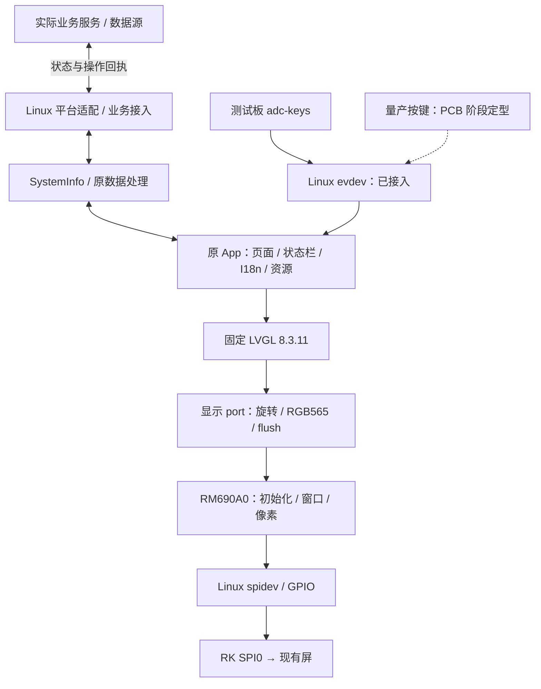

# RK3506J RM690A0 / LVGL 应用迁移架构与计划

当前源码基线：`7b49532`。P0–P2 已完成各自阶段的离线目标；P3 已用 SPI mode 3 点亮测试图，并在 32 MHz 请求档完成一轮 LVGL benchmark，整轮平均 57.3 FPS。P4 显示与测试板导航验收已按既有记录关闭：修正版九页限时运行、evdev 四键导航、页面返回及 Debug 监视器已复核，详见 [P4 记录](P4_APPLICATION.md)。当前主机默认 CTest 7/7、独立 benchmark CTest 1/1 通过；此次核对未重新执行 ARM 构建或板端测试。真实业务进入 P5；最新动画的板端回归、英俄逐页目视对照、退出清理警告与长时间运行归 P6；P3 物理波形与供电轨仍待实测。

## 1. 目标与范围

移除 HC32，由 RK3506J 在 Linux 上直接驱动现有 RM690A0 屏幕，迁移原应用的页面、资源、交互与业务状态。保持 294×126 横向 UI、RGB565、页面动画与英俄语言切换，并接入真实业务数据、输入和关机流程。

首版按“显示点亮 → 原应用显示迁移 → 业务接入 → SDK 集成”推进。用户确认当前测试板为 RK3506J 512MB+8GB，屏沿用现有供电电路，正常启动并经 SPI 传输后自动点亮；当前不做背光亮度控制。量产按键及整机电源相关功能明确延后到量产 PCB 阶段，不作为显示构建前置条件；测试板现有 `adc-keys` 的 evdev 四键已在 P4 接入。显示测试、真实业务与量产功能分别验收；演示数据不能作为完整业务迁移交付。新增远程管理、多屏、固件升级不在本轮范围。

详细来源、初始化序列和迁移注意事项见 [HC32 迁移摘要](HC32_MIGRATION.md)。P2 已完成原厂 kernel/rootfs 构建、Simulator 对照构建与主机/ARM LVGL 基线验证；HC32 原工程保持不变，Simulator 修复只应用到隔离副本。未烧录硬件。构建结果与复现见 [P2 基线](P2_BASELINE.md)。

P1 的实接线、设备树冲突检查和阶段边界见 [硬件定型记录](../board/rk3506j/HARDWARE.md)。当前测试板显示接口已定型，P2 离线构建已完成，P3 测试图已实屏显示；存储介质、电气参数和物理波形仍需后续核实，不代表量产硬件验收已完成。

## 2. 技术基线

| 项目 | 当前依据 | 规划决定 |
| --- | --- | --- |
| 构建主机 | SDK 手册 V1.5 §1.2–1.4：Ubuntu 20.04、普通用户、至少 100 GB 空间、建议至少 8 GB 内存 | 使用已构建 Docker 环境 |
| RK SDK | sdk/atk_dlrk3506_linux6.1_release_v1.3.1_20260326；Linux 6.1、Buildroot、ARM32/Cortex-A7 | 测试板 512MB+8GB，P2 暂按 J/eMMC 的 22 号配置准备；板端确认介质/容量后用于部署 |
| 交叉工具链 | kernel 预置 GCC 10.3.1；Buildroot 配置为 GCC 12.4.0/glibc | 应用使用 Buildroot 生成的工具链、加载器与 sysroot |
| 应用来源 | HC32 的 Simulator/App，固件也编译此目录 | 保留原 C11/C++17 应用结构与资源 |
| LVGL | 旧工程 8.3.11；RK SDK 提供 8.4.0/9.1 配方 | 首版固定旧 8.3.11 验证迁移，不混用 SDK 另一份库 |
| 屏驱动 | Adafruit_ST7789 类内实际使用 generic_RM690A0 | 提取实际命令协议，替换 Arduino/HC32 传输依赖 |
| 显示参数 | 126×294 控制器坐标 + LVGL ROT_90 → 294×126 UI；RGB565 | 保留方向、字节序、窗口寻址，取消单色页打包假设 |
| SPI | RK J 型 dtsi 包含已启用 SPI0/spidev 的板级 dtsi | 已在测试板核实 `/dev/spidev0.0` 和 SPI0 SCLK/MOSI/CS0 pinmux；屏端波形待测 |

LVGL 8.4.0 升级可以后续独立验证，不与硬件迁移同时强制进行。应用私有链接旧 LVGL 时，构建规则必须明确依赖归属，避免 SDK 默认 DRM 示例或另一版本 LVGL 混入目标。

## 3. 硬件映射与边界

RK 接口依据本项目原理图 ATK-DLRK3506JS V1.0.pdf 第 4 页与 SDK rk3506-pinctrl.dtsi；旧接线依据 HC32 mcu_config.h。SCLK、MOSI、CS、D/C、RESET 已按用户实际接线确认；JP1 编号适用于该 ATK 底板。板端 pinmux 显示 SPI0 SCLK/MOSI/CS0 已复用，GPIO1_C4/C6 可由显示程序申请；屏端实际波形尚未测量。

| 屏信号 | 旧 HC32 | RK 接口与状态 |
| --- | --- | --- |
| SCLK | PB15 | JP1-17 / SPI0_CLK / GPIO0_C0 |
| MOSI | PB13 | JP1-13 / SPI0_MOSI / GPIO0_C1 |
| CS | PB14 | JP1-14 / SPI0_CSN0 / GPIO0_C3 |
| 备用 CS | — | JP1-16 / SPI0_CSN1 / GPIO0_B7，不接屏 |
| D/C | PB1 | **JP1-10 / GPIO1_C6，bank 内 offset 22，用户确认** |
| RESET | PB2 | **JP1-12 / GPIO1_C4，bank 内 offset 20，用户确认** |
| MISO | 旧屏对象未配置 | JP1-15 / GPIO0_C2 可用性按模块需求确认 |
| 屏供电 | 现有屏配套电路 | 用户确认由 SGM3849 给 AMOLED 供电，不新增供电/BL/PWM 控制；输出轨未实测 |

JP1 所画连接器编号 1–30，虽然区块标题为 40PIN；实际接线按编号和实板方向确认。屏端 SCL/SDA 标签分别对应 SPI SCLK/MOSI。旧 PBxx 编号不能直接转成 RK GPIO offset。已编译核查的三个 MIPI 基线中未发现启用节点占用 GPIO1_C4/C6；RGB888 明确占用二者，与当前接线冲突。USB regulator 控制 GPIO 未启用、音频功放控制 GPIO 已由板级删除，不需为屏控制线关闭整个 USB/音频设备。如后续改为 GPIO 控制 CS，不能与内核硬件 CS 同时驱动该引脚。

已知：RM690A0 初始化、294×126 UI、RGB565、mode 3/8bit/MSB-first、用户实际接线、512MB+8GB 测试板及现有供电方式。500 kHz 实屏测试图已显示；当前采用非 RGB 基线，MIPI 实屏不纳入本轮验收。最大速率和物理波形仍待测；测试板按键原接 P1_B3，但与运行中 UART2 TX/sysfs 冲突；P4 已改用测试板 `adc-keys` 的 evdev 四键，已确认该板对应 `/dev/input/event0`。旧 GPIO1_B4 改接方案不再使用；量产按键设计和整机电源延期。旧库 32 MHz 常量不是旧板实测速率，也不能替代屏规格。

## 4. 目标架构与复用边界



| 部分 | 复用内容 | 需要适配 |
| --- | --- | --- |
| App | 9 个页面、状态栏、页面路由、动画、语言及资源 | 移除页面中 MCU 复位/电源耦合，保留业务含义 |
| 共享数据 | SystemInfo 字段及现有交互语义 | 从 mcu_config 中拆出平台无关定义；明确数据源、请求与回执 |
| 日志 | EasyLogger 已有 Linux port | 与目标线程/输出方式核对 |
| LVGL 显示 port | 区域刷新、原旋转、2 像素对齐逻辑 | 替换 DMA/NVIC，核对颜色交换、分段与完成通知 |
| 屏控制器 | 用户确认的初始化表、窗口及方向设置 | Linux 的命令/数据事务、GPIO、延时、错误处理 |
| 输入 port | 保留原交互语义和页面结构 | 测试板 evdev 四键已接入；量产输入适配延期，无按键回归可静态选页 |
| 时间/主循环 | P4App::init / on_input / update_status、lv_timer_handler | Linux 单调时钟、等待、退出和资源释放；LVGL 操作保持在同一主线程 |
| 整机电源 | 保留原流程作为量产适配参考 | 量产电源键、电源保持、充电及相关复位动作延后；当前长按只演示页面，不执行断电/复位 |
| 业务接入 | 原数据字段、请求和状态流程 | P5 明确实际提供方及 I²C 替代通路，不阻塞当前屏点亮 |
| SDK 集成 | 厂商 CMake 包的集成模式 | 应用包、固定依赖、项目配置、权限、自启动 |

以用户态屏协议实现首版，复用内核 SPI/GPIO；有明确 framebuffer/DRM 需求时再评估，不能与 spidev 同时绑定同一片选。原页面、ResourceManager、PageManager、DataCenter 已存在，不重新设计平行框架。

## 5. 显示实现约束

- 初始化应复现旧调用链：两次硬件 reset → 11 条 RM690A0 命令 → 0x36/0x00 → 清黑。表内 255 为 500 ms，完整显式等待约 1800 ms；详见迁移摘要。
- 首版固定旧 RGB565 线上字节顺序、控制器 126×294 与 LVGL 90° 软件旋转，保留原双绘制缓冲，采用同步 SPI；在全部发送完成后通知 LVGL。
- 一帧为 74088 字节，旧每块绘制缓冲为 18522 字节。P3 默认每段最多 4096 字节；当前板端 `spidev.bufsiz=65535`，但 32768 字节分段仍须核实控制器限制与屏端 CS 连续性。500 kHz 下单帧仅像素载荷就需约 1.19 秒，不能据点亮结果推断原动画性能。不要把 MCU 的 uint16_t DMA 长度直接搬到 Linux。
- 不新建单色显存页转换或不必要的全屏影子缓冲。校验窗口起止、字节序、方向、非整行区域、缓冲生命周期、失败清理及超时恢复。
- 初期不把异步发送、多线程或 DMA 优化作为前置条件；保留原动画，测量刷新瓶颈后再优化。不能把 LVGL handler 调用频率当成实屏帧率。
- 屏供电沿用现有电路，不新增背光/PWM/亮度接口；原初始化中的 0x51/0xFF 不变。测试板 P1_B3 按键不能按当前运行配置直接使用；当前应用使用 evdev，设备节点与键码应在目标系统核实，无按键可用 `--display-only`。旧 MCU 电源状态或对端缺失不能阻止显示。明确标注延期功能和测试数据，不能据此报告整机功能已通过。

## 6. 目录与变更归属

```text
ATK_RK3506/
├── README.md
├── docs/                       原始资料、计划、HC32 迁移摘要、构建说明
├── docker/                     已实现：编译镜像与环境检查
├── application/                CMake、Linux IO、显示 port 与九页 P4 画面
│   ├── CMakeLists.txt
│   ├── App/                    原九页 View、PageManager、资源及直接依赖
│   ├── demo/                   独立 benchmark 入口与 FPS/CPU 统计
│   ├── platform/               当前 Linux SPI/GPIO 适配
│   ├── display/                RM690A0 协议与 LVGL 显示 port
│   └── config/                 lv_conf
├── third_party/                已提取 LVGL 8.3.11 及来源；其他依赖按需引入
├── board/rk3506j/              已记录接线与 P1 硬件检查
├── refer/01_lvgl_button/       已实屏运行的参考程序源码
├── patches/                    已保存旧 Simulator 补丁
├── tests/                      已实现：屏协议、Linux IO 与显示回归检查
├── .github/workflows/           主机 CMake/CTest CI
├── out/                        本项目构建产物，不入版本库
└── sdk/                        已有厂商多仓 SDK，当前被忽略
```

目录划分表达职责，具体文件随实现建立。保留第三方/资源来源和许可文本；不复制整套 Arduino 核心来模拟 MCU。SDK 修改写入源配置/项目包并保存补丁，不修改 output/build 生成目录。自启动方式依据 rootfs 实际 init 系统选择。

## 7. 分阶段计划

原计划针对新建简单状态页的时间估算不再作为完整应用迁移承诺。当前先推进显示范围，P5 业务接入及后续量产输入/电源适配分别估算。

| 阶段 | 交付 | 验收条件 | 当前状态 |
| --- | --- | --- | --- |
| P0 环境/资料 | Docker、工具链检查、架构、旧工程提取 | 普通用户 SDK 预检与 ARM 编译通过；来源可追溯 | 已完成离线准备 |
| P1 测试板显示接口定版 | 512MB+8GB 测试板、实接线、供电方式、pinmux、延期范围 | 显示接口和 P2 工作基线明确，未测项归入上板检查 | **当前显示范围已定型；不等于实机或量产验收** |
| P2 构建基线 | 原厂 kernel/rootfs，原 Simulator 对照，应用目标 CMake | 原厂构建通过；旧应用与选定 LVGL 配置可追溯 | **已完成离线基线，2026-09-21 复核通过** |
| P3 屏驱动 | 原初始化、Linux IO、窗口与分段 | 彩条/四角/边框正确，片选及错误处理验证 | **实屏点亮、重启及 benchmark 完成；32 MHz 请求档画面正常，边缘受遮挡，物理波形与最大可用速率待测** |
| P4 应用显示迁移 | 原页面、状态栏、资源、动画、英俄切换 | 页面显示与测试板四键导航验收；最新动画及逐页英俄目视回归另列 P6 | **已完成：九页 View、PageManager、状态栏及 evdev 输入已接入；修正版九页限时运行、按键导航、页面返回及 Debug FPS/CPU/内存监视器已在测试板复核。LVGL 退出清理警告转入 P6 稳定性跟踪；业务状态与操作转入 P5** |
| P5 业务与系统集成 | 真实数据/设置回执、Buildroot、自启动 | 已接入业务不依赖演示值；整机关机/充电等延期 | **下一步：先接入状态数据与设置回执，再接入录制/Wi-Fi/持久化；保持未实现动作禁用** |
| P6 显示稳定性/交付 | 运行记录、补丁、构建/部署说明 | 连续显示、应用退出/重启、失败恢复通过；量产电源测试另列 | **待实施；跟踪一次 `active screen was deleted` 退出清理警告及长时间运行** |
| 量产 PCB 阶段 | 量产按键设计、整机电源/充电及相关系统操作 | 按量产原理图重新定型、适配、验收 | 用户明确延期；测试板 evdev 验收不能代替量产设计验收 |

顺序：先确认接口并建立原厂基线，再点亮屏、对照 UI、接真实业务。无需等待硬件才能做源码提取和离线构建，但不能将离线通过当作实屏通过。部署、复位、烧录和电气测量须有明确目标与范围。

## 8. 验证与风险

| 类别 | 必测项 |
| --- | --- |
| 屏协议 | 11 条表及延时、reset、0x36、窗口终点、RGB565 字节序、CS/DC、超过 4096 字节传输 |
| 图形 | 四角/边框、红绿蓝、旋转、2 像素对齐、局部区域及边界、原页面动画 |
| 应用 | 九页导航、英俄资源、状态栏及页面定时器生命周期；evdev V+/V- 移焦、MENU 确认/长按、ESC 返回 |
| 业务 | 数据更新、设置成功/失败回执、断连、记录状态、在线判断、取消/确认操作 |
| 生命周期 | 启动无设备、SPI 失败、正常退出/重启及资源释放；整机保存/断电/复位职责在量产阶段验收 |
| 构建 | ARM32 ABI、动态加载器、目标库、单一 LVGL 版本、配置与资源一致性 |

候选稳定性指标：8 小时无崩溃/持续内存增长，10 次启动显示正常。真实状态更新目标 10 Hz、延迟目标 ≤100 ms；当前 `p4_screen` 的占位状态周期为 200 ms（5 Hz），不代表已满足真实业务目标。页面动画帧率另行实测并与原体验对照。均为待验证目标，需根据合法 SPI 速率与业务更新周期确认。

主要风险：类名误导选错初始化、255 延时误译、双重旋转/交换、spidev 消息超限、CS 状态依赖、旧 32 MHz 常量误当实测，以及把测试数据或明确延期的功能报告为已完成。电源硬件承接在量产阶段重新定型。逐层验证，不直接改 LVGL 内核猜测花屏原因。

## 9. 当前结果与下一步

已完成：P3 点亮与 benchmark、P4 九页 View/状态栏/PageManager/evdev 接入及已记录的测试板验收。当前 `p4_screen` 仍由 `DemoStatus` 提供占位状态，工作模式、录制和 Wi-Fi 业务按钮保持禁用；开机、加载、保存配置只是页面演示，不执行真实检查、持久化或断电。`7b49532` 的主机默认测试 7/7、benchmark 测试 1/1 通过，SDL 预览构建通过；既有 ARM/板端记录不等于最新提交已经上板验证。

下一步按依赖推进：

1. **P5 最小业务闭环**：先确认真实数据提供方及现有传输通路，再接状态快照和一个设置请求/成功或失败回执，覆盖超时与断连；保持 LVGL 单线程和未实现动作禁用。随后接入录制、Wi-Fi、持久化及 Buildroot 包、权限与 BusyBox 自启动。
2. **P6 最新版本回归与稳定性**：重新构建 ARM 产物，在明确授权后复核恢复后的 250 ms 页面动画、四键导航及英俄逐页布局；复现 `active screen was deleted` 退出警告，验证资源释放、失败恢复，并执行 10 次启动和 8 小时运行检查。上述目标尚未验收。
3. **并行补 P3 物理实测**：在屏端核对 SCLK/MOSI/CS/DC/RST 波形、SGM3849 输出轨及可视边缘；32 MHz 请求档正常、47 MHz 请求档黑屏的边界见 [性能记录](P3_DISPLAY.md#lvgl-benchmark-实屏性能2026-09-24)。在确认波形和屏模组限值前，不将 P3 标为完整物理验收通过。
